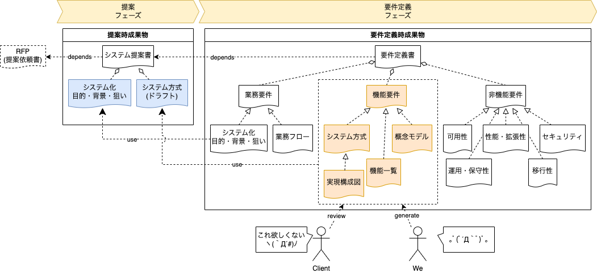
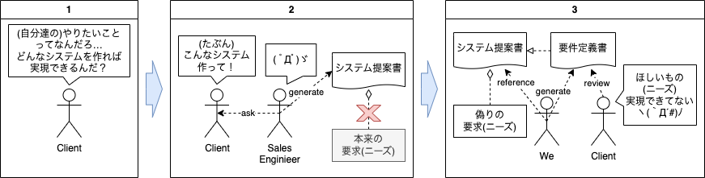
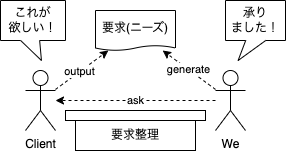

## 要件定義で「こんなものが欲しかったわけじゃない(怒)」とお客さまに言われたら「要求整理」が必要なサインかもしれません(前半)

ギークの皆みな様、今日も元気にハックされてますか？  
ご無沙汰してます、サワベです。  

いやはや、ほんと暫くぶりに記事を書くことになりました(´ｰ\`A;) ｱｾｱｾ  
というのも最近、仕事の方でビジコン(ビジネスコンサル)とまではいきませんが要件定義のさらに前段？のRFP(提案依頼書)やシステム提案書で検討する内容に近しいところの整理を行うことになりまして。  
てんやわんやしていたら落ち着いて記事を書いている暇がなかった、といった次第です。  
まぁ、言い訳ですよね。。。すみませんm( _ _ )m

ということで、今回はタイトル通り、だいぶ **「ヤバメな状況を連想させる場面」** に遭遇した話について書こうと思います。  
さすがの **「やってやれないことはない！(やらずにできたらちょーらっきー)」** がモットーの私もだいぶヒヤヒヤさせられました｡ﾟﾟ(*´□\`*｡)°ﾟ。

**「どうしてこうなった？」** から **「どうやって解決した？」** に至るまで順に整理していきたいと思いますので、よろしければお付き合いください(^-^)/  
そして、この経験が私の仲間(サワベが勝手に思ってる(;￣Д￣))でもあられるギークの皆みな様の何かしらのお役に立てば幸いです。

### システム提案書を元に要件定義したら「こんなものが欲しかったわけじゃない」と怒られた

さてさて、早速ですが「どうしてこうなった？」から整理していきます。  
お客さまに怒られるまでのフローは下記になります。

* **システム提案書** を元に要件定義書の機能要件を深掘りした
* 要件を深掘りしたシステム方式や機能一覧を見たお客様が **「こんなものが欲しかったんじゃない」** と怒った

今回は **「RFP(提案依頼書)」** がなかったので、システム開発側でまとめた **「システム提案書」** を元に要件定義を進めておりました。通常、システム提案書ではお客さまのニーズやらをざっくり可視化しているはずなので、それを元に深掘りすること自体は問題ないはずなんです。。。はい。 **「通常は」** って条件付きですよ！

ところがどっこい、深掘りした要件を見たお客さまは怒ったわけです｡ﾟﾟ(*´□\`*｡)°ﾟ。

**「こんなものが欲しかったわけじゃない(怒)」**

うーん。なにが悪かったのだろう。。。続いて原因について分析していきましょう。

### 原因はお客さまの「ほしいもの」が落ちてないシステム提案書を鵜呑みにしたせい！？

お客さまに怒られた後、原因について分析したんです。結果、導き出された答えは…

**「お客さまニーズがシステム提案書に落ちてないじゃん！？」**

でした。  
いやはや、ヒトコトで言ってしまうと簡単な原因に思えますが、この原因にたどり着くにはいろいろと苦労がありました｡ﾟﾟ(*´□\`*｡)°ﾟ。  
私が **「最近よくある」** と感じている **「深い闇」** をお客さまが抱えていたわけですが、それについての考慮も必要だったわけです。

* お客さま自身が **ほしいもの(ニーズ)** について整理できていなかった
* お客さま自身がほしい(と思われる)ものについての **技術的な知識** を持っていなかった

うーん。

**「なかなか闇が深いですね(´ｰ\`A;) ｱｾｱｾ」**

まず最初の **「お客さま自身、自分が何がほしいのかわからない」** という時点でかなり意味不明な状態なのですが、最近では、結構 **「あるある」** な話ではないかと思ってます。

我々のトイメンに立っているお客さまも自身の所属する会社のミッションを遂行しているわけですから、当然、経営層から今後の会社の行く末について託されるわけです。特に昨今では **「DX(デジタルトランスフォーメーション)」** というキーワードが一人歩きして **「DX推進しないと経済損失がぁー」** とかおっしゃられる経営層の方々もいらっしゃるわけで。そこからの期待を一身に受け、自社のDXを成功させるため **「ああしたい」** **「こうしたい」** というニーズを捻り出すわけですから整理がなかなかできないのも頷ける話ですね。  
また、 **「ほしいものの技術的な知識」** うんぬんというのも、ニーズの整理がついてない時点で当然と思えてきます。

上記を踏まえ、お客さまに怒られるに至った経緯をまとめると下記になるのかな、と。

いやはや、実のところを言うと、私も薄々、上記のリスクがありそうということでプロジェクト管理側には警鐘を鳴らしていたのですが。。。結局、スケジュール的に余裕がないからといってお客さまのニーズをしっかりと確認をせず、システムを実現するための技術的な深掘りを推し進めてしまいましたorz  
やはり、こういう **「危機感」** といいますか **「ヤバいな」** と感じた直感は無視したらダメですね。。。良い教訓となりました。

今後、同じような場面に立ち合ったら、真っ先に

**「要求整理しましょう！」**

と声を大にして言いたいと思います(^^)/

### 対策としてお客様のニーズを引き出す「要求整理」を行うことに

さぁ、原因が分かれば対策のターンです。  
今回は **「要求整理」** というフェーズの名のもとにお客さまのニーズを引き出す期間を作ることにしました。

要は、ニーズの整理が不十分とし要件定義の前に **「要求整理」** という整理期間をねじ込むことにしたんです。  
お客さまには要求整理フェーズの必要性について下記のように説きました。  
(前に述べた、お客さまの抱える闇についてダイレクトに伝えるわけにもいきませんしね(´ｰ\`A;) ｱｾｱｾ**)

* 要件定義ではお客さまとのニーズに対する認識のズレが大きいことが判明
* ズレの原因はお客さまと我々とでコミュニケーションが圧倒的に少なかったことが原因  
  (お客さまから直接ニーズを聞かず、システムを実現するための検討を優先してしまった)
* 要件定義の前に、短い周期、ブレスト形式でお客さまのニーズを引き出す「要求整理」をさせてほしい

これにはお客さまも納得していただきました。

**「君たちは私たちに歩み寄ってくれない」**

と、コミュニケーションロスについて示唆する発言も多かったですし。なにより、お客さま自身 **「自分達が導入したいと言っているシステム」** についての技術的な知識がなさすぎて、我々に

**「このシステム入れると何ができるの？」**

といった基本的なところから、いろいろと聞きたくて仕方がなかったようです。  
我々としても堂々とお客さまに **「なんでこれやりたいんですか？」** といったニーズについて整理する期間を得られましたし、なにより、要件定義のレビュー内では時間の都合上伝え切れなかった技術情報をどんどんインプットできたわけです。

結果、お互い **「Win-Win」** となったと思います。

ということで、今回は **「どうしてこうなった」** についてお伝えしましたが、ここで一旦締めたいと思います(ちょっとつかれたー。小休止したい(_ _)zzZ)  
次回は具体的な要求整理の中身について触れていきたいと思いますので、よろしければ、また、お付き合いいただければ幸いです！

アディオス(*´ω｀)ﾉｼ