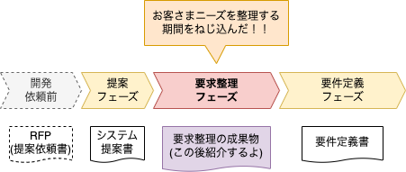
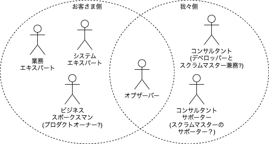
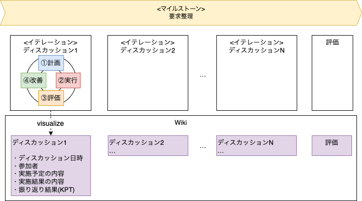
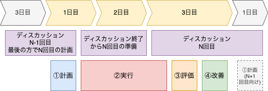
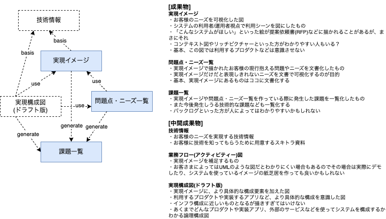
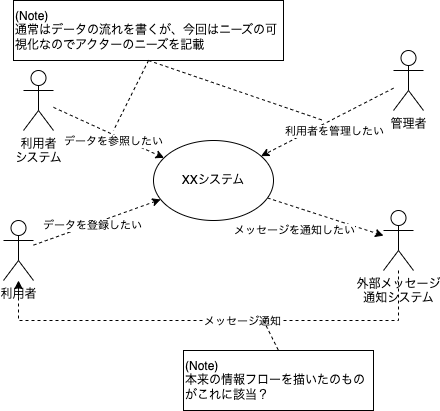

## 要件定義で「こんなものが欲しかったわけじゃない(怒)」とお客さまに言われたら「要求整理」が必要なサインかもしれません(後半)

ギークの皆みな様、今日も元気にハックされてますか？  
例によって、サワベです。  

本稿は **「要求整理のススメ」** について書かせていただいている記事の後半となります。  
前半では **「どうしてこうなった(要求整理が必要な状態に陥った)？」** についてお話させていただきましたが、後半では **「どうやって解決した？」** についてお話できればと思いますので、よろしければお付き合いください(^^)/

### おさらいも兼ねて

前半では **「要求整理」** の必要性について下記のようにお客さまに説いたところで終わっていました。  
大事なので再度お伝えしますね！

* 要件定義ではお客さまとのニーズに対する認識のズレが大きいことが判明
* ズレの原因はお客さまと我々とでコミュニケーションが圧倒的に少ないのが原因  
    (お客さまから直接ニーズを聞かずに資料を作ってレビューしていた)
* 要件定義の前に、短い周期、ブレスト形式でお客さまのニーズを引き出す「要求整理」をさせてほしい

ということで、具体的にどのようにお客さまのニーズを引き出したかについて紹介したいと思います。

### 要求整理は下記のように行った

**「どのように紹介するのがわかりやすいだろう？」** ということで、むかーし、昔 **「5W1Hで話をまとめるといいよー！」** というのがありましたよね？(え、現役だろって？…うーん、そうかも！)  
まとめてみると下記のようになりました！

* (Why)お客さまとのニーズに対する認識のズレが大きかったので
* (When)要件定義の前に
* (Who)お客さまと要求整理を行うコアメンバーが
* (Where)オンサイトかつ短い周期、ブレスト形式で開催される打ち合わせのなかで
* (How)実現イメージや問題点・ニーズ一覧といった成果物を作ることで
* (What)お客さまニーズ(要求)を整理した

とりあえずお伝えしたいことの大半は盛り込めた気がします(^^)  
若干、枝葉でお伝えしたいこともあるので、そちらは適宜差し込んでいく形で説明できればと。

### (Why)お客さまとのニーズに対する認識のズレが大きかったので

既に前半からお客さまとの間でニーズに対するズレがあったことについてはお話していたかと思います。が、改めて要求整理を行う動機として挙げたいかと。  
実際、この **「ズレ」** を解消すべく **「打ち合わせのやり方」** や **「成果物」** を工夫してみたのでこの後の紹介でお伝えできればと思います。

### (When)要件定義の前に

これも前半からお話していた内容ですね。ブレイクタイム？ハーフタイム？的な感じで、お客さまと我々との間のニーズに対するギャップを埋めるフェーズを作りました。

### (Who)お客さまと要求整理を行うコアメンバーが

メンバーについてですが、お客さまと我々とでニーズを出すために必要と思われるメンツを揃えました。

#### お客さま側
* 業務エキスパート -- お客さまサイドの現行業務、システムを使った運用面に精通した人
* システムエキスパート -- お客さまサイドの現行システムに精通した人
* ビジネススポークスマン -- お客さまサイドのビジネス戦略を代弁する人。スクラムでいうところのプロダクトオーナーに近い存在

#### 我々側
* コンサルタント -- 実際に要求整理を行う人。スクラムで言うところのデベロッパーとスクラムマスターを兼務した役割の人。今回はサワベが担当
* コンサルタントサポーター -- コンサルタントのサポートを行う人。コンサルタントの相談役であり、コンサルタントが整理に集中できるように動いてくれる人。スクラムマスターのサポート役に近い

#### その他(お客さまおよび我々どちらも)
* オブザーバー -- 客観的な視点を保ち、整理の方向性があらぬ方向に行かないよう助言をする人

お客さま側の業務、システムのエキスパートはその名の通りで、現場の声の代弁者ということでニーズを引き出す上では非常に重要な方々となります。また、ビジネススポークスマンも、とても重要です。スクラムで言うところの **「プロダクトオーナー」** 的な存在がいないと、ニーズが **「その企業のビジネス戦略にとってどれくらい優先されるものなのか」** 判断できません。実際、お金的な意味で決済権を持っているのは現場ではなくビジネスサイドになるので、その代弁をする存在も非常に重要となります。

一方、我々は、というと、コンサルタントは言うまでもありません。お客さまに代わって実現すべきシステムに対するニーズを整理する人です。また、実際に要求整理フェーズの進行役も行うことになるのでスクラムで言うところの **「デベロッパーとスクラムマスターを兼ねた人」** になります。今回は私サワベが担当いたしました。また、コンサルタントサポーターはサポーターと言っていますが、相棒的な存在 **「コンサルタントバディー」** と言った方が良いかもしれません。時にコンサルタントの相談役であり、コンサルタントが整理に集中できるように動いてくれる人で **「スクラムマスターのサポート役」** になります。今回も私は大変お世話になりました(^^)/

その他ですが、お客さま、我々どちらもとなりますが、オブザーバーという一歩引いたところから整理の状況を傍聴する人も参加しておりました。要は外部から **「チャチャ」** を入れる人たちのことですが、悪い意味での介入ではなく第三者的な目線で意見をくれる人たちになります。我々側だと **「プロジェクトマネージャー」** が **「スコープやスケジュールについてのツッコミを入れる」** だったり、お客さま側だと **「(まだエキスパートの域まで到達していない)若手の方」** が **「フラットな意見や疑問をぶつける」** など、整理したニーズがあまりにもスケジュールを無視したものだったり、業務やシステム都合になりすぎていたり、といったことがないよう調整する意味で大事な存在でした。

### (Where)オンサイトかつ短い周期、ブレスト形式で開催される打ち合わせのなかで

さてさて。ここからが本題です。  
要求整理ですが、お客さまと我々とで **「打ち合わせ」** という時間をとることで整理していくわけですが、この打ち合わせという場をどのようにセッティングしたかについてお伝えしましょう。  
今回は下記のような場にいたしました。

* ビデオチャットなどによるオンライン会議(オフサイト)ではなく実際に対面してのオンサイトで
* 打ち合わせ頻度は1週間に２回程度
* 資料をガッツリ作ってレビューしてもらうのではなく参加者が自由にディスカッションしていくブレインストーミング形式にて

と、大きく上記3つに重点をおいた打ち合わせにいたしました。  
1つ目の **「オンサイト」** という点については、お客さまにお叱りを受けるという失態を犯した要件定義時(2022年9〜10月頃)にコロナ禍というのもあってオフサイトで打ち合わせを行なっていたのですが、やはり初めてのお客さまの場合、オンライン会議は難しいですね(´ｰ\`A;) ｱｾｱｾ  
カメラやマイクだと微妙な表情(相槌など)を拾うのが難しくコミュニケーションロスがかなり発生しておりました。  
上記理由から今回はオンサイトというリアルに対面しての会議を実施することにしました。

2つ目については **「簡易版のスクラム？」** とか　**「アジャイル？」** と言った方が伝わりやすいかもしれません。  
人によっては **「そんなのスクラムじゃねぇー(怒)」** とおっしゃる方もいらっしゃると思いますので、以降は **「(なんちゃって)アジャイル」** と表現することにいたします。2、3日というとても短いイテレーションをクルクル回すことで実施しました。

１つのイテレーション内では計画、実行、評価、改善と一通りの流れを実施しています。  
計画や実施した結果、振り返りの内容はWikiを使うことで議事録やレビュー記録などを作らなければならないという余計なオーバーヘッドを削減しました。

1回のイテレーションのタイムスケジュールですが、少々変則的なので上記の図でまとめました。  
1日目は1つ前のディスカッションの終わりで日時や実施予定の内容について決定します。それ以降と2日目の実施予定日まではディスカッション向けの簡易的な資料を作ったりといった準備をします(決して休んでたわけじゃないですよ(´ｰ\`A;) ｱｾｱｾ)  
そして、3日目はディスカッション当日で実施予定の内容についてディスカッションし、最後に簡単にKPT法を使った評価と振返りを実施して次回の計画を…と、かなりタイトなスケジュールで整理を行なっていました。

実際には、1週間のうち火曜と木曜にディスカッションを実施していたのですが、準備期間については1日、2日しかなく、かなりハードでした。が、もともとお客さまにも **「資料をガッツリ作ってのレビューではなくブレスト形式で」** とお話していたので、割となんとかなりました。資料などはネットに転がっている記事を使ったり、その場で(drawioなど使って)絵を描いたりと、アドリブが許されたのもなんとかなった理由かもしれません。しかも、この短い周期でディスカッションすることで、前回の内容を思い出すための振り返りや整理する意欲(熱)が冷めにくかったという点で非常に良かったと思っています。  
まぁ、実際、スケジュール的な意味でもあんまり時間をかけるわけにいかなかった、という悲しい事情もあったわけですが、ね(´ｰ\`A;) ｱｾｱｾ

### (How)実現イメージや問題点・ニーズ一覧といった成果物を作ることで

やり方がわかったところで、こちらも気になっている方が多いのではないでしょうか？

**「具体的にどんなもの作って要求整理したの？」**

についてです。

上記の図のように、基本的に成果物は大きく３つとしました。

* 実現イメージ
* 問題点・ニーズ一覧
* 課題一覧

実現イメージはお客さまのニーズを絵にしたものです。具体的な内容についてですが

**「こんなシステムが欲しいですよね？」**

と、お客さまと我々で認識を合わせるためのものなので正直フォーマットはないに等しいと思ってます。  
なので、過去にやった別案件でのシステム利用シーン(Webシステムであれば画面操作しているシーンなど)を持ってきても良いですし、世の中一般にあるシステムが要求されるシステムであれば、その利用シーンを持ってきて認識合わせをしても良いと思います。  
ただ、利用シーンをバラバラと描くだけだと

**「ざっくりどんなシステムが欲しいんだっけ？」**

と全体を見失いやすいので **「俯瞰できる１枚絵」** を用意した方が良いと思います。  
１枚絵は、白紙の中央に **「システム」** という大きな丸を描き、関連システムや利用者、運用者といった **「アクター」** を登場させたもので良いと思います。私ですと、UMLを見ても拒否反応を示さないお客さまの場合 **「コンテキスト図」** のようなものを描いたりしますが、拒否反応を示すお客さまの場合 **「リッチピクチャー？」** のような、もう少し噛み砕いたパワポの絵を描いたりします。

下記はかなり適当な絵(コンテキスト図に近いもの)ですが、参考までにイメージとして載せておきます。

今回、私が担当したお客さまには、上記と併せ、一部、業務フロー(アクティビティ図)を描くことでイメージ合わせを行いました。

その他の成果物についてですが、 上記の実現イメージに登場する **「ニーズ(矢印の「xxしたい」)」** を文章として一覧化した **「問題点・ニーズ一覧(※)」** や実現イメージ、問題点ニーズ一覧を作成している中で出た解決すべき技術的な課題などを一覧化した **「課題一覧」** を作成することでニーズを整理しました。  
(※)問題点・ニーズ一覧には実現イメージとして表現しきれないニーズを文章として記載することも重要

また、中間成果物にはなりますが、

* 業務フロー(アクティビティー図)
* 技術情報
* 実現構成図(ドラフト版)

なども作りました。  
業務フローはすでにお伝えしてますが、実現イメージを補足する資料ですし、技術情報も実現イメージや問題点・ニーズ一覧を補足するものになります。特に今回はお客さまとの認識の **「ズレ」** を解消すべく、技術情報を多めに提供しています。技術情報はニーズを実現する上で必要となる知識を提供するもので **「スキトラ(スキルトランスファー)」** というなの勉強会を行うことでお客さまとの認識を合わせていきました。

あと、実現構成図についてですが、実現イメージの **「俯瞰できる１枚絵」** に近しいものになります。大きな違いと言えば、よりシステムライクな図である点でインフラ構成といった物理構成図よりは論理的な図になりますが、システムを実現する上で必要となる具体的なサービスやプロダクト名などが登場する図となります。  
なお、本格的にこの図を描くのは要件定義フェーズなので、要求整理フェーズでは必須ではないです。  
が、実現イメージで描いているものが本当に実現できるか確認するために、もう少し具体的な構成を描いて確認されるのが良いと思います。

### (What)要求(ニーズ)を整理した

上記で述べた手法や成果物をもってお客さまのニーズを整理しました。

ということで、ちょっと後半は長かったですね(_ _)zzZ  
**「どうやって解決した？」** についてお伝えしましたが、いかがでしたでしょうか？

実際、ニーズを整理するのはかなり大変でしたが、この後の要件定義フェーズで **「実はこの機能って直近いらなくない？」** というスコープ決めをしたり **「ほしい機能って何があるんだっけ？」** という機能一覧を作ったりする過程で、とても重要なインプットとなっています。

もし、皆さんも、お客さまに

**「こんなものが欲しかったわけじゃない(怒)」** 

と言われたら、是非 **「要求整理」** をしてみてください！  
(まぁ、怒られる前になんとかすべきってのはありますが(´ｰ\`A;) ｱｾｱｾ)

今回は以上となります。  
最後まで見てくれたギークの皆みな様、ありがとうございます！  
そして、また次回、役立つ情報を提供できるよう頑張りたいと思いますので、  
その際はまたお付き合いいただければと思います！

アディオス(*´ω｀)ﾉｼ